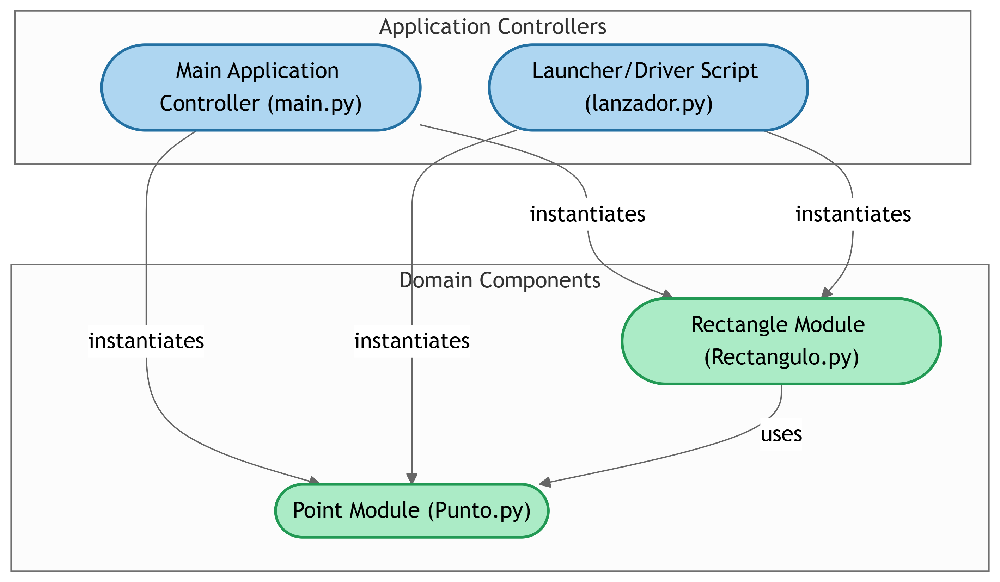

# Primer-parcial

Este es el link a mi repositorio:


# Primer-parcial

## Descripción
Este proyecto contiene el código desarrollado para el primer parcial. El propósito del proyecto es [describir brevemente el objetivo del código, por ejemplo: resolver un problema específico, implementar una funcionalidad, etc.].

## Contenido
El proyecto incluye los siguientes elementos:
- **Archivos principales**: [Lista de archivos relevantes del proyecto].
- **Funciones principales**: [Breve descripción de las funciones o características implementadas].

## Diagrama del Proyecto
A continuación, se presenta un esquema gráfico que describe la estructura o flujo del proyecto:



## Requisitos
Para ejecutar este proyecto, necesitas:
- [Lista de herramientas o dependencias necesarias, por ejemplo: Python 3.10, Node.js, etc.]
- [Cualquier otra configuración necesaria].

## Instalación
Sigue estos pasos para instalar y configurar el proyecto:
1. Clona este repositorio en tu máquina local:
   ```bash
   git clone <URL-del-repositorio>